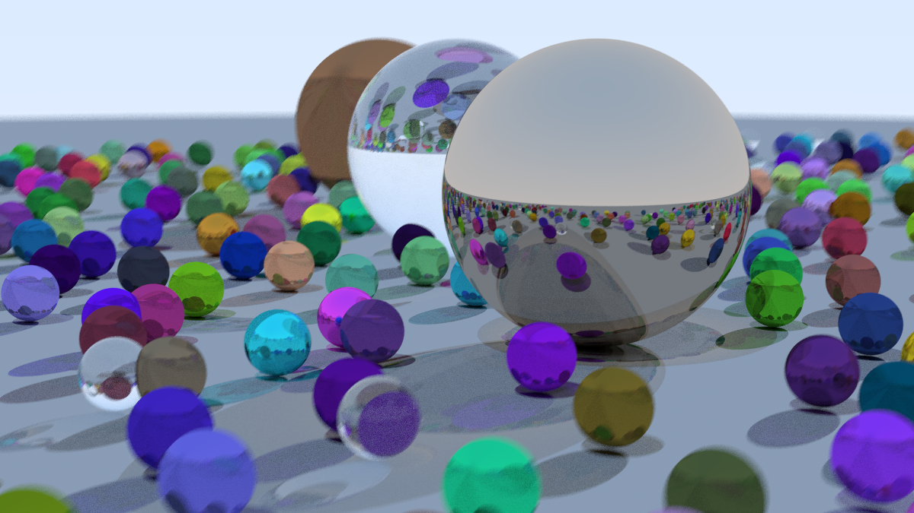
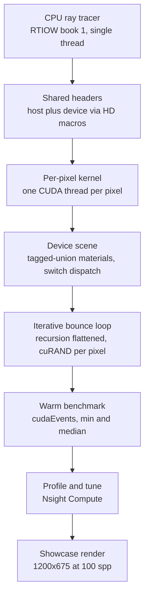

# ⚡ CUDA Ray Tracer

**A *Ray Tracing in One Weekend* renderer, ported from single-threaded C++ to CUDA and benchmarked on an RTX 4060.**

The classic RTIOW book-1 scene (spheres, glass, metal), rendered on the GPU with one thread per pixel. The same scene that takes 51 seconds on one CPU core finishes in under half a second on the GPU. This repo is the port, a boost-aware benchmark harness, and the honest profiler-driven story of what actually made it fast.



*1200x675, 100 samples per pixel, max depth 50. Rendered on an RTX 4060 in about 2.6 seconds.*



---

## 📊 Results

400x225, 100 spp, max depth 50. RTX 4060 versus one CPU core, all GPU times measured warm (see the benchmarking note below).

| Version | Render time | Speedup vs CPU |
| --- | --- | --- |
| CPU, single thread | 51.4 s | 1x |
| CUDA, naive port | ~448 ms | ~115x |
| CUDA, camera hoist + 32x4 blocks | ~445 ms | ~115x |

Full size (1200x675, 100 spp): CUDA renders in **2.6 s**, which is *sub-linear*: 9x the pixels for only ~6x the time, because more pixels fill the GPU better.


| Metric | Naive | Optimized |
| --- | --- | --- |
| Registers per thread | 95 | 71 |
| Achieved occupancy | 27.6% | 37.9% |

...but higher occupancy did not become speed, because the kernel is latency-bound on ray divergence (only ~11 of 32 threads active per warp), which none of these optimizations touched. `--use_fast_math` actually ran 5% *slower* despite raising occupancy further. The takeaway: occupancy is a proxy, the stopwatch is the truth.

---

## ✨ Features

- 🟢 **One thread per pixel** across the whole GPU.
- 🟢 **Three materials** (Lambertian, metal, dielectric) via tagged union and switch dispatch, no vtables.
- 🟢 **Antialiasing and defocus blur** from per-pixel cuRAND state.
- 🟢 **Iterative bounce loop**, recursion flattened to fit tiny GPU stacks.
- 🟢 **Shared host/device headers**, one codebase builds both the CPU and CUDA renderers.
- 🟢 **Boost-aware benchmark harness**: warmup plus min/median over timed runs via cudaEvents.
- 🟢 **Profiler-driven tuning** with Nsight Compute and a block-size sweep.

---

## 🧰 Tech stack

| Area | Tooling |
| --- | --- |
| CPU renderer | [C++17] (MSVC) |
| GPU compute | [CUDA 13.3] (nvcc), arch `sm_89` | |
| Profiling | [Nsight Compute] |
| Build | (`build.ps1`) |
| Image tooling | [PPM to PNG] (`ppm2png.py`) |
| Hardware | [NVIDIA RTX 4060] (8 GB, Ada) |

---

## 🛠️ How I built it (the process)

I'd just finished the CPU version of *Ray Tracing in One Weekend* and wanted to actually feel where the GPU speedup comes from instead of reading about it. So I ported the whole thing to CUDA by hand, one slice at a time: get the `vec3` and `ray` headers compiling on both host and device, then a hello-world gradient kernel, then spheres, then cuRAND and antialiasing, then materials and the full scene. Every slice built, rendered, and got eyeballed against the CPU image before I moved on.

The hardest part was that my clean object-oriented design just didn't survive the trip to the GPU. Host vtables are garbage on the device, so the `Hittable`/`Material` hierarchy with its virtual `scatter()` collapsed into a tagged union I dispatch with a `switch`. And GPU stacks are tiny, so the recursive `ray_color` had to flatten into an iterative bounce loop that carries a running throughput forward instead of multiplying on the way back up the stack. I knew both were coming. Rewriting them myself still taught me more than any blog post had.

---

## 📚 What I learned

- **Parallelism beat cleverness.** The ~115x came from running one thread per pixel across the 4060's cores, not from anything clever I added. When I finally compared the naive port against my "optimized" one fairly, both warmed up, the camera hoist and block-size tuning landed within 1% of each other. Humbling, and the most useful thing I measured all project.
- **The port breaks the design.** vtables and pointers mean nothing on the device, and recursion doesn't fit in a GPU stack. You can't just recompile a CPU renderer for the GPU, you have to rethink how dispatch and control flow map onto the hardware.

---

## 🚀 How it could be improved

- **Ray divergence is the real bottleneck** (~11 of 32 threads active per warp). Fix with ray compaction or Russian-roulette path termination so a warp isn't held hostage by its few longest rays.
- **Static image only.** Make it interactive: GLFW plus CUDA-OpenGL interop, 1 sample per frame with temporal accumulation, for a 120 fps arrow-key flythrough. The kernel itself transfers almost unchanged.
- **CPU baseline is single-threaded.** Add an OpenMP variant so the comparison is "versus N cores," not just one.
- **Boost-clock variance.** Lock GPU clocks (`nvidia-smi -lgc`) for bit-stable numbers instead of relying on warm min/median.

---

## ▶️ How to run the project

### 1. Install deps

- [CUDA Toolkit 13.3](https://developer.nvidia.com/cuda-toolkit) (provides `nvcc`)
- Visual Studio with the **Desktop development with C++** workload (provides `cl.exe`)
- Python with Pillow: `pip install pillow`

### 2. Build and run

```powershell
.\build.ps1 -Run
python ppm2png.py image.ppm
```

`build.ps1` compiles the CPU renderer, and the CUDA renderer whenever `main.cu` is present, then runs whichever exists. It prints the warm min/median render time to stderr.

### 3. View the render

Open `image.png`. For the full-size showcase, set `width`/`height` in `main.cu`'s `main()` to 1200/675 and rebuild.

<details>
<summary><b>Toolchain notes (Windows)</b></summary>

- **`build.ps1` locates the MSVC environment** via `vswhere` and imports `vcvars64.bat`, then prepends the CUDA `bin` (from `CUDA_PATH`) so `nvcc` resolves.
- **`-arch=sm_89`** emits native code for the RTX 4060 (Ada) so the driver never has to JIT-compile PTX. Change this to match your GPU's compute capability.
- **`--use_fast_math` is deliberately omitted**: it measured ~5% slower here (see Results).
- **Nsight profiling needs GPU performance counters unlocked**: run as admin, or set NVIDIA Control Panel to allow performance counters for all users, otherwise `ncu` returns `ERR_NVGPUCTRPERM`.

</details>

<sub>**Machine:** RTX 4060 (8 GB, Ada) with CUDA 13.3 and MSVC 14.44. Built as a GPU / ML performance-engineering learning project.</sub>
