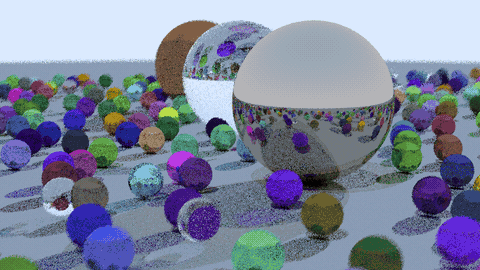
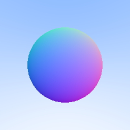
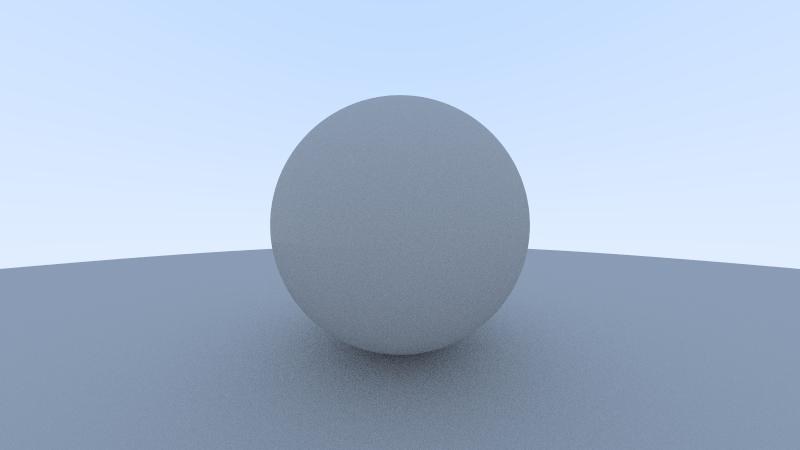
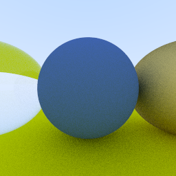

# ⚡ CUDA Ray Tracer → Real-Time Flythrough

**A *Ray Tracing in One Weekend* renderer taken all the way from a single sphere on the CPU to a real-time, GPU-path-traced world you can fly through at ~90 fps — built in CUDA + OpenGL on an RTX 4060.**

<p align="center">
  
</p>

*Live 1-sample-per-frame path tracing with temporal accumulation: noisy while you fly (WASD), converging to a clean image in ~1 s when you stop. 800×450, max depth 8, ~90 fps on an RTX 4060.*

This began as the classic RTIOW book-1 renderer and grew in **five stages** — from a single ray-traced sphere, to physically-shaded glass and metal, to a hand-written CUDA port that runs **~115× faster** than one CPU core, to a real-time interactive renderer with a keyboard-flyable camera. Below is the whole journey, one image per stage.

---

## 🎞️ The journey, stage by stage

### 1 · A sphere out of rays


Shoot a ray through every pixel, test it against one sphere, and color the hit by its surface **normal**. No lighting yet — just the camera math and geometry, with a simple vertical sky gradient behind it. This is the "the math works" milestone.

### 2 · Real light, real shading


Add a **diffuse (Lambertian)** material and a ground sphere. Rays now *bounce* and lose energy, so the ball is lit by the sky instead of painted by its normals — the matte grey is light actually being simulated, with antialiasing softening the edges.

### 3 · Materials: glass and metal


Three materials in one scene: a diffuse blue sphere (center), a **glass/dielectric** sphere that refracts the world through it (left), and a reflective **gold metal** sphere (right), on the classic yellow ground. This is the "it's really a renderer now" moment.

### 4 · Onto the GPU (~115× faster)


The entire tracer, ported to **CUDA** — one thread per pixel across the RTX 4060's cores. The same 488-sphere scene that takes **51 s on one CPU core** renders in under half a second on the GPU. *(1200×675, 100 spp, max depth 50, ~2.6 s.)*

### 5 · A world you can fly through


Drop to **1 sample/frame**, wire the camera to the keyboard, and add a **temporal accumulation** buffer: the image is grainy while you move and converges to clean within ~1 s when you hold still. **~90 fps** end-to-end (≈112 fps of pure GPU compute) at 800×450. The playable payoff.

---

## 📊 Results

### Static render — CPU vs CUDA
400×225, 100 spp, max depth 50. RTX 4060 versus one CPU core; all GPU times measured warm (see the benchmarking note below).

| Version | Render time | Speedup vs CPU |
| --- | --- | --- |
| CPU, single thread | 51.4 s | 1× |
| CUDA, naive port | ~448 ms | ~115× |
| CUDA, camera hoist + 32×4 blocks | ~445 ms | ~115× |

Full size (1200×675, 100 spp): CUDA renders in **2.6 s** (median 3.0 s), which is *sub-linear* — 9× the pixels for only ~6× the time, because more pixels fill the GPU better.

**The honest part:** the optimizations barely moved the wall clock. Measured fairly (naive and optimized both warmed up), the camera hoist and block-size tuning landed within 1% of each other. The ~115× is **parallelism, not clever tuning.** What the optimizations *did* change was the profiler picture:

| Metric | Naive | Optimized |
| --- | --- | --- |
| Registers per thread | 95 | 71 |
| Achieved occupancy | 27.6% | 37.9% |

…but higher occupancy did not become speed, because the kernel is **latency-bound on ray divergence** (only ~11 of 32 threads active per warp), which none of these optimizations touched. `--use_fast_math` actually ran 5% *slower* despite raising occupancy further. The takeaway: occupancy is a proxy, the stopwatch is the truth.

### Real-time render — interactive
800×450, 1 spp/frame, **max depth 8**, temporal accumulation, warm:

| Measure | Frame time | FPS |
| --- | --- | --- |
| GPU compute (render + convert) | ~8.9 ms | ~112 |
| End-to-end frame (+ CUDA–GL interop + blit) | ~11 ms | ~91 |

Converges to a clean image in ~1 s when the camera holds still. Capping ray depth from 50 → 8 bought **1.69×** with no visible quality loss on this scene — most rays already terminate early, so the cap only trims the rare deep paths.

---

## ✨ Features

- 🟢 **Real-time interactive camera** — keyboard flythrough (WASD + up/down) at ~90 fps.
- 🟢 **Temporal accumulation** — 1 spp/frame while moving, converging to a clean image when still.
- 🟢 **CUDA–OpenGL interop** — the framebuffer never leaves the GPU: kernel writes a Pixel Buffer Object mapped into CUDA, blitted straight to a fullscreen texture.
- 🟢 **One thread per pixel** across the whole GPU.
- 🟢 **Three materials** (Lambertian, metal, dielectric) via tagged union and switch dispatch, no vtables.
- 🟢 **Antialiasing and defocus blur** from per-pixel cuRAND state.
- 🟢 **Iterative bounce loop**, recursion flattened to fit tiny GPU stacks.
- 🟢 **Shared host/device headers** — one codebase builds both the CPU and CUDA renderers.
- 🟢 **Boost-aware benchmark harness** — warmup plus min/median over timed runs via cudaEvents.
- 🟢 **Profiler-driven tuning** with Nsight Compute and a block-size sweep.

---

## 🧰 Tech stack

| Area | Tooling |
| --- | --- |
| CPU renderer | [C++17](https://en.cppreference.com/w/cpp/17) (MSVC) |
| GPU compute | [CUDA 13.3](https://developer.nvidia.com/cuda-toolkit) (nvcc), arch `sm_89` |
| Per-pixel RNG | [cuRAND](https://docs.nvidia.com/cuda/curand/) |
| Windowing / GL | [GLFW](https://www.glfw.org/) + [GLAD](https://glad.dav1d.de/), OpenGL 3.3 (via [vcpkg](https://vcpkg.io/)) |
| Live display | CUDA–OpenGL interop (`cuda_gl_interop.h`) |
| Profiling | [Nsight Compute](https://developer.nvidia.com/nsight-compute) |
| Build | [PowerShell](https://learn.microsoft.com/en-us/powershell/) (`build.ps1`) |
| Image tooling | [Pillow](https://python-pillow.org/) (`ppm2png.py`) |
| Hardware | NVIDIA RTX 4060 (8 GB, Ada) |

---

## 🛠️ How I built it (the process)

I started from the CPU version of *Ray Tracing in One Weekend* and rebuilt it outward in the five stages above. First a single sphere colored by its normals, proving the ray–camera math. Then diffuse shading and a ground so light actually bounced, then glass and metal materials, then the full book-1 scene rendering on the CPU.

With that working, I ported the entire thing to **CUDA** to feel where the GPU speedup really comes from — one thread per pixel, materials as a tagged union dispatched by `switch` (device code has no vtables), and the recursive color function flattened into an iterative bounce loop that carries a running throughput forward (GPU stacks are tiny). Same images, ~115× the speed.

The last leap was making it **real-time**. I kept the framebuffer on the GPU end-to-end with CUDA–OpenGL interop, dropped to one sample per pixel per frame, and added a temporal accumulation buffer so a still camera keeps stacking samples toward a clean image. A keyboard-driven camera and a live FPS readout turned the static renderer into a world you can fly around in — from one 2D sphere to an interactive world of spheres.

---

## 📚 What I learned

- **Modern C++, sharpened.** Operator overloading on a `vec3` type, RAII and `shared_ptr` scene graphs, and the discipline of headers that compile on both host and device.
- **CUDA from scratch.** Kernels, **threads and blocks**, grid/block sizing, per-pixel cuRAND state, unified memory, and cudaEvents for timing — plus how a clean OO design has to be *rethought* (tagged unions over vtables, iteration over recursion) to fit the hardware.
- **OpenGL and GPU interop.** Textures, shaders, a fullscreen-triangle blit, and CUDA–OpenGL interop so the path-traced buffer never round-trips through the CPU on its way to the screen.
- **Parallelism beat cleverness.** The ~115× came from one-thread-per-pixel across the GPU, not micro-optimizations — measured fairly, a camera hoist and block-size tuning landed within 1% of each other. The kernel is latency-bound on ray divergence, which occupancy tricks never touched. Occupancy is a proxy; the stopwatch is the truth.
- **Real-time is a budget.** 60 fps = 16.6 ms, 120 fps = 8.3 ms. Capping ray depth 50 → 8 bought 1.69× for free because most rays terminate early. And accumulation only works in **linear** color space — gamma has to wait until display, or the running average comes out wrong.

---

## 🚀 How it could be improved

- **Physics.** Give the spheres velocity, gravity, and collisions so the world moves on its own, not just the camera.
- **More than spheres.** Add triangles/meshes, planes, and boxes so scenes aren't sphere-only.
- **Solid barriers.** Camera collision so you can't fly *through* spheres or drop through the ground — turning the flythrough into a walkable space.
- **Kill ray divergence.** The real perf bottleneck (~11 of 32 threads active per warp); wavefront path tracing or Russian-roulette termination so a warp isn't held hostage by its longest rays.

---

## ▶️ How to run

### Real-time interactive renderer

```powershell
.\build.ps1 -Interactive
.\raytracer_interactive.exe
```

Fly with **WASD**, **Space / Left-Shift** for up/down. The window title shows live frame time and FPS. Requires GLFW + GLAD (installed via vcpkg — see toolchain notes).

### Static (offline) renderer

```powershell
.\build.ps1 -Run
python ppm2png.py image.ppm
```

`build.ps1` compiles the CPU renderer, and the CUDA renderer whenever `main.cu` is present, then runs whichever exists and prints the warm min/median render time. Open `image.png` to view it. For the full-size showcase, set `width`/`height` in `main.cu`'s `main()` to 1200/675 and rebuild.

<details>
<summary><b>Toolchain notes (Windows)</b></summary>

- **`build.ps1` locates the MSVC environment** via `vswhere` and sources `vcvars64.bat` in-process, then prepends the CUDA `bin` (from `CUDA_PATH`) so `nvcc` resolves.
- **`-arch=sm_89`** emits native code for the RTX 4060 (Ada) so the driver never JIT-compiles PTX. Change it to match your GPU's compute capability.
- **Interactive deps:** GLFW + GLAD via [vcpkg](https://vcpkg.io/) (`x64-windows`); `build.ps1 -Interactive` links `glfw3dll.lib` + `glad.lib` + `opengl32.lib` and copies `glfw3.dll` next to the exe. The vcpkg libs use the dynamic CRT, so the nvcc host flag is `/MD`.
- **Hybrid-GPU (Optimus) gotcha:** CUDA–GL interop needs both the GL context and CUDA on the *same* GPU. The exe exports `NvOptimusEnablement = 1` to force the NVIDIA GPU; without it, interop lands on the Intel iGPU and fails.
- **`--use_fast_math` is deliberately omitted** — it measured ~5% slower here (see Results).
- **Nsight profiling needs GPU performance counters unlocked** — run as admin or allow counters for all users in the NVIDIA Control Panel, otherwise `ncu` returns `ERR_NVGPUCTRPERM`.

</details>

<sub>**Machine:** RTX 4060 (8 GB, Ada) with CUDA 13.3 and MSVC 14.44. Built as a GPU / ML performance-engineering learning project.</sub>
